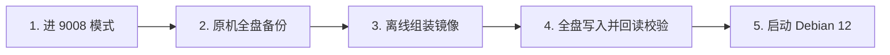

# UFI103S (V02/V03) Debian 12 固件与 9008 刷机方案

[-red?logo=debian)](https://www.debian.org/)
[]()
[]()
[]()

专为 Qualcomm MSM8916 方案随身 Wi-Fi（`UFI103S_V02` / `UFI103S_V03`）定制的 Debian 12 纯净固件与全盘 9008 刷写工具链。

支持 USB RNDIS 网卡、Wi-Fi AP 热点/客户端双模、SSH 远程管理、蜂窝 4G 驻网，并可平滑切换为 **VoCat 短信转发网关**。

---

## ⚡ 特性概览

- **Debian 12 (Bookworm)**：精简纯净，开机自启 WCNSS Wi-Fi 驱动与 USB Gadget。
- **开箱即用网络**：默认启用 USB RNDIS DHCP 网关 (`192.168.68.1`) 与 Wi-Fi AP 热点 (`10.42.0.1`)。
- **蜂窝与短信双模**：
  - 默认由 ModemManager + NetworkManager 管理 4G 蜂窝数据连接。
  - 内置 `ufi103s-modemmanager` 工具，一键释放 AT/QMI 端口供 **VoCat** 独占转发短信，不影响 Wi-Fi 与 USB DHCP。
- **安全全盘流程**：基于原厂 GPT 布局与同机完整备份组装镜像，严密回读比对，杜绝变砖与射频校准丢失。

---

## 📋 快速速查表 (Quick Reference)

### 1. 默认连接凭据

| 项目 | 默认值 | 说明 |
| :--- | :--- | :--- |
| **USB 网关 IP** | `192.168.68.1` | 宿主机插入 USB 后 DHCP 自动获取 `192.168.68.x` |
| **Wi-Fi 热点 (SSID)** | `4G-WIFI` | 默认网关为 `10.42.0.1` |
| **Wi-Fi 密码** | `12345678` | WPA2-PSK |
| **SSH 账号 / 密码** | `user` / `1` | 仅允许从 USB 与 Wi-Fi 接入，已屏蔽外网蜂窝口 SSH |
| **Root 提权** | `sudo -i` | 密码同样为 `1` |

> [!WARNING]
> 默认密码 `1` 与热点密码为公开默认值，部署到公开或不受信任网络前请务必及时修改！

### 2. 硬件兼容性与限制

| 板号 / 型号 | 验证状态 | eMMC 严格大小 (字节) | 说明 |
| :--- | :---: | :---: | :--- |
| **UFI103S_V02** | ✅ 已实测验证 | `3,909,091,328` | USB/Wi-Fi/SSH/4G/VoCat 功能均正常通过实测 |
| **UFI103S_V03** | ✅ 已实测验证 | `3,909,091,328` | 需核对原厂 GPT，固件与基带兼容 |
| **其他 UFIx0x** | ⚠️ 未经实测 | - | 仅作兼容性推测，**严禁盲刷**，必须自行验证 DTB/SoC/GPT |

> [!IMPORTANT]
> **基带校准与跨机限制**：
> 1. 原厂 `fsc`、`fsg`、`modemst1`、`modemst2` 及 `persist` 等射频校准分区必须**来自当前待刷机器本身的备份**，**绝不能把一台机器的校准分区刷入另一台机器**。
> 2. Android 的 `modem.bin` 不能直接写进 rootfs，Linux 下的 MPSS 固件由固件包内 `/lib/firmware` 独立驱动。

---

## 🚀 刷机指南 (四步极简流)

详细环境配置、KVM 虚拟机穿透与故障恢复，请参阅 📖 **[完整刷机手册 (docs/FLASHING.md)](docs/FLASHING.md)**。



### 第一步：准备文件与进入 9008 (EDL)

1. 从 [v2.2.0 Release](https://github.com/maomomo-eth/ufi103s-debian/releases/tag/v2.2.0) 下载：
   - 基础包：`ufi103s-debian-v2.2.0-base.tar.gz`
   - 系统镜像：`rootfs-debian12-usb-wifi-ssh-vocat-mm-wifi.img`
2. 按住棒子 **SIM 卡槽旁的按键** 并插入电脑 USB（或在原系统下运行 `adb reboot edl`）。
3. 检查设备识别状态：
   ```bash
   lsusb -d 05c6:9008
   ```

### 第二步：完整备份原机 eMMC (必备保命步骤)

```bash
# 设定环境变量 (请使用机器背贴上的真实 15 位 IMEI 命名)
export EDL="/path/to/edl"
export BACKUP="/path/outside/repo/ufi103s-v02/bak-<15位IMEI>"

# 执行全盘与关键分区备份
EDL="$EDL" ./scripts/backup-full-emmc.sh "$BACKUP"
(cd "$BACKUP" && sha256sum -c SHA256SUMS)
```

### 第三步：离线组装整盘镜像

```bash
export RELEASE="/path/to/ufi103s-debian-v2.2.0-base"
export ROOTFS="/path/to/rootfs-debian12-usb-wifi-ssh-vocat-mm-wifi.img"
export PREPARE="/path/outside/repo/prepare-work"

./scripts/flash-edl-full-emmc.sh \
  --backup-dir "$BACKUP" --release-dir "$RELEASE" \
  --rootfs-override "$ROOTFS" \
  --rootfs-sha256 65fa6962951cafd1fc38d886d6e8df714904b61c2443cdfb7c4e436f3c31e2d6 \
  --output-dir "$PREPARE" --prepare-only
```

### 第四步：写入 9008、恢复校准并回读校验

```bash
export FLASH="/path/outside/repo/flash-work"

EDL="$EDL" ./scripts/flash-edl-full-emmc.sh \
  --backup-dir "$BACKUP" --release-dir "$RELEASE" \
  --rootfs-override "$ROOTFS" \
  --rootfs-sha256 65fa6962951cafd1fc38d886d6e8df714904b61c2443cdfb7c4e436f3c31e2d6 \
  --output-dir "$FLASH" --reset
```
写入完成后设备会自动重启。等待 1-2 分钟后，插入 USB 即可通过 `ssh user@192.168.68.1` 登录！

---

## 🛠️ 初始化后常用管理命令

### 1. 蜂窝网卡诊断
登录后首先执行内置的只读检查工具，确认 MPSS 基带与 `rmtfs` 运行状态：
```bash
sudo ufi103s-modem-test
```

### 2. VoCat 短信转发模式切换
当需要使用 VoCat 独占 AT/QMI 端口收发短信时，需屏蔽 ModemManager（**切勿停止 NetworkManager**，否则会导致 Wi-Fi 和 USB 断网）：
```bash
# 释放端口给 VoCat 独占 (持久生效，重启不复发)
sudo ufi103s-modemmanager disable
ufi103s-modemmanager status

# 恢复系统 ModemManager 管理蜂窝上网
sudo ufi103s-modemmanager enable
```

### 3. 配置 Wi-Fi 连接至外部路由器 (客户端模式)
如需让设备连接家里的路由器 Wi-Fi 上网：
```bash
# 1. 删除默认的 AP 热点
nmcli connection delete WIFI

# 2. 交互式扫描并连接外部 Wi-Fi
nmtui-connect

# 3. (推荐) 清除 Wi-Fi 频段绑定，避免路由器跳频后断连
WIFI_NAME="你的路由器SSID"
nmcli connection modify "$WIFI_NAME" 802-11-wireless.channel ""
nmcli connection modify "$WIFI_NAME" 802-11-wireless.band ""
nmcli connection modify "$WIFI_NAME" connection.autoconnect yes connection.autoconnect-priority 100
```

### 4. 安全加固 (修改密码与精简账户)
```bash
# 修改当前用户及 root 密码
passwd
sudo passwd root

# (可选) 允许 root 登录并彻底删除默认 user 用户
sudo rm /etc/ssh/sshd_config.d/20-ufi103s-usb.conf
sudo pkill -u user
sudo userdel -r user
```

---

## 📚 文档导航 (Docs)

| 文档 | 内容说明 |
| :--- | :--- |
| 📖 **[完整刷机手册 (docs/FLASHING.md)](docs/FLASHING.md)** | 详尽的环境依赖、安全校验机制、同机二次重刷 (`--reflash-debian`) 及强刷说明 |
| 💬 **[短信与 VoCat 排错指南 (docs/SMS_TROUBLESHOOTING.md)](docs/SMS_TROUBLESHOOTING.md)** | 常见运营商 SIM 卡短信实测结果、AT 状态码自检及端口独占说明 |
| 🖥️ **[KVM / virt-manager USB 穿透 (docs/KVM_USB.md)](docs/KVM_USB.md)** | 解决虚拟化环境下 9008 与 Debian RNDIS 切换时的 USB 重枚举穿透问题 |
| 🔬 **[Debian 12 构建记录 (docs/DEBIAN12.md)](docs/DEBIAN12.md)** | 历史根文件系统修改、DTB 补丁、Firmware 提取与打包过程 |
| 📝 **[故障排查与复盘 (docs/POSTMORTEM.md)](docs/POSTMORTEM.md)** | 历史红灯不开机、基带未就绪、DTB 内存节点缺失等问题的踩坑复盘 |

---

## ⚖️ 许可与第三方引用

- 本项目遵循 [MIT License](LICENSE)。
- 第三方工具链与固件来源声明请参阅 [THIRD_PARTY.md](THIRD_PARTY.md)。
